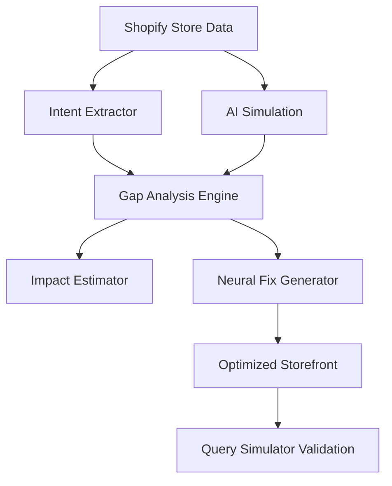

# 🤖 AI RepOptimizer: Perception Intelligence Engine

> **The first real-time intelligence engine optimizing Shopify stores for the Agentic Web.**

[](https://github.com/aakashyo/KASPARRO-HACKATHON)
[](https://groq.com)
[](https://nextjs.org)

## 🧠 The Problem
E-commerce is shifting from traditional keyword search (Google/Amazon) to **Agentic AI Shopping**. Users now ask LLMs: *"Find me a mineral sunscreen under ₹1500 for oily skin."*

Most Shopify stores are **invisible** to these agents because their data is ambiguous, incomplete, or unstructured. **AI RepOptimizer** bridges the gap between what a merchant *intends* and what an AI Agent *perceives*.

---

## 🚀 Key Features

| Feature | Description | Impact |
| :--- | :--- | :--- |
| **Merchant Intent Extraction** | Uses LLMs to understand the deep context behind raw product titles/tags. | Establishes the "Source of Truth." |
| **AI Perception Simulation** | Simulates a strict AI Shopping Agent to see how it "sees" your store. | Identifies misinterpretations. |
| **Intelligence Gap Engine** | Detects missing attributes and semantic confusions in real-time. | Triage severity of data gaps. |
| **Neural Fix Strategy** | Generates optimized descriptions and structured tags tailored for LLMs. | Improves ranking in AI searches. |
| **Query Simulator** | An interactive sandbox to test how AI ranks products for natural queries. | Real-world validation of fixes. |

---

## 🛠️ Tech Stack

| Component | Technology | Role |
| :--- | :--- | :--- |
| **Backend** | Python / FastAPI | High-performance orchestration & API. |
| **AI Inference** | Groq (Llama 3.3 70B) | Deep analysis and reasoning at speed. |
| **Frontend** | Next.js 14 / React | Professional, glassmorphic dashboard. |
| **Styling** | Tailwind CSS / Framer Motion | Premium UI animations and dark mode. |
| **Data Fetch** | Shopify GraphQL Admin API | Real-time store data ingestion. |

---

## 🏗️ Intelligence Pipeline



---

## 📥 Installation & Setup

### 1. Prerequisites
- Python 3.10+
- Node.js 18+
- Groq API Key
- Shopify Development Store + Admin API Token

### 2. Backend Setup
```bash
cd backend
pip install -r requirements.txt
# Create .env and add:
# GROQ_API_KEY=your_key
# SHOPIFY_STORE_URL=your_store
# SHOPIFY_ADMIN_TOKEN=your_token
python -m backend.main
```

### 3. Frontend Setup
```bash
cd frontend
npm install
npm run dev
```

---

## 📂 Project Structure

```text
├── backend/
│   ├── services/      # AI Intelligence Modules (Gap Engine, Simulator)
│   ├── utils/         # LLM Client & Prompt Templates
│   ├── models/        # Pydantic Schemas
│   └── main.py        # FastAPI Orchestrator
├── frontend/
│   ├── app/           # Next.js Pages & Layouts
│   ├── components/    # Reusable UI (ProductCards, QuerySimulator)
│   └── lib/           # API Wrappers & Demo Data
└── .gitignore         # Safety first (Excludes .env)
```

## 🛡️ License
Distributed under the MIT License. See `LICENSE` for more information.

---
**Built for the KASPARRO HACKATHON 🚀**
